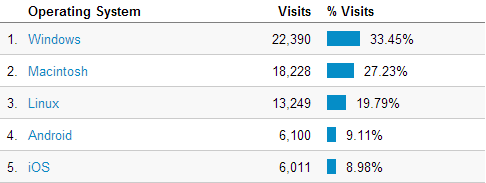

When I first came to University lots of people (like [Rob Miles](https://www.robmiles.com)) were trying to get undergraduates to start blogging. On the 6th of March 2012 I registered this domain and started blogging, getting myself added to the awesome [Hull Compsci blogs syndicate](https://hullcompsciblogs.com). That was two years ago and a lot has changed so I thought I would write a summary post.

#### Open source stuff
My first blog was a Wordpress one, but I felt that Wordpress was trying to be too much and I just wanted something a bit more lightweight. So, inspired by [svbtle](https://svbtle.com) I created and released [Simple](https://github.com/orf/simple) which powers this blog. [A least a few other people use it for their blogs](https://www.google.co.uk/#q=%22Powered+by+Simple%2C+inspired+by+Obtvse%22+-%22tomforb.es%22) as well which is kind of cool depite me not giving the project much attention recently.

I primarily use [GitHub](https://github.com/orf/) to share all my open source code. Over the last year I've made 379 contributions to both my own repositories and others that I use, and somehow gathered 48 followers. My most popular repository is [Simple](https://github.com/orf/simple) which has 481 stars and 96(!) forks, followed by my [Django Debug toolbar panel](https://github.com/orf/django-debug-toolbar-template-timings) with 191 stars.

I've put a few projects on the [Python package index](https://pypi.python.org/pypi) as well, and a couple seem to be used a fair bit: The [Debug toolbar panel](https://pypi.python.org/pypi/django-debug-toolbar-template-timings) had 3690 downloads in the last month and my [HtmlToWord](https://pypi.python.org/pypi/HtmlToWord) library had 3812 (which I find weird because unlike the other package I can't locate a single project other than mine that actually uses it). 

#### Popular posts
In the last two years this blog has had 67,184 visitors with a peak of over 1,000 concurrent viewers, which is pretty neat. Simple handled every request speedily with no errors.

The most popular posts are:

  1. [Purchasing a £30,000 numberplate for the price of a bus ticket](https://tomforb.es/purchasing-a-£30-000-numberplate-for-the-price-of-a-bus-ticket)
  2. [Breaking out of secured Python environments](https://tomforb.es/breaking-out-of-secured-python-environments)
  3. [Just how slow are Django templates](https://tomforb.es/just-how-slow-are-django-templates)
  4. [Opera is really nice](https://tomforb.es/opera-is-really-nice)
  5. [Automatically inline Python function calls](https://tomforb.es/automatically-inline-python-function-calls)
  6. [Using Python metaclasses to make awesome Django model field choices](https://tomforb.es/using-python-metaclasses-to-make-awesome-django-model-field-choices)
  7. [Adding tail call optimization to Python](https://tomforb.es/adding-tail-call-optimization-to-python)

According to [Google Webmaster tools](https://www.google.com/webmasters/) some of my popular posts have quite high google rankings for some queries:

  * [Django template performance](https://www.google.co.uk/#q=Django+template+performance)
  * [Tail call optimization python/python tail call optimization](https://www.google.co.uk/#q=tail+call+optimization+python)
  * [Django model metaclass](https://www.google.co.uk/#q=django+model+metaclass)
  * [Django slow](https://www.google.co.uk/#q=django+slow)

##### Viewer information
I use Google Analytics for my website stats and it also tracks things like browser usage, operating system and screen resolution. 

<table><tr><td></td><td></td></tr></table>

#### Security stuff
I found a  4 "grave" security issues in some software that got issued their own CVE numbers (which is awesome!):
 [osvdb.org/creditees/11331-tom-forbes](https://osvdb.org/creditees/11331-tom-forbes).
Slightly before I started this blog I also [presented a research paper](https://media.blackhat.com/bh-eu-12/Siddharth/bh-eu-12-Siddharth-Xpath-WP.pdf)
at the BlackHat security conference which was the most scary hour of my life. I haven't really blogged about it but I intend to in the coming weeks.

#### Conclusion
I'm pretty happy with the last two years and I'm both excited for the future and a bit sad that my time at Hull is coming to a close.
    