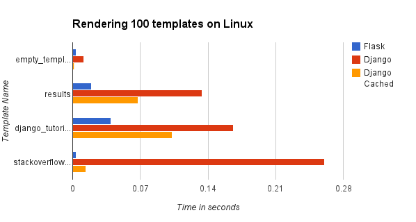
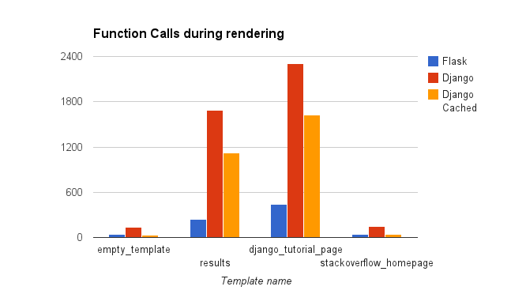

*Edit 2: I made a Django debug toolbar panel that profiles your Django templates and all their components. You can find it here: [https://pypi.python.org/pypi/django-debug-toolbar-template-timings](https://pypi.python.org/pypi/django-debug-toolbar-template-timings)*

*Edit: It appears that Django does have some form of [template caching](https://docs.djangoproject.com/en/dev/ref/templates/api/#django.template.loaders.cached.Loader). The graphs have been updated to include this.*

I've always kind of known that [Django templates](https://docs.djangoproject.com/en/1.5/ref/templates/) are kind of slow compared to [Jinja2](https://jinja.pocoo.org/docs/) but I have never been bothered enough to test them head to head, until now. *Note:* This isn't an attack on Django, and if you haven't tried it already its well worth a go. Speed of execution is not everything, and template rendering is only one component, optimizing network and database time is often more fruitful.

#### Jinja2 or Django?
I have heard good things about Jinja2 with regards to performance, mostly because Jinja2 compiles templates down to Python bytecode during rendering, so the template only needs to be parsed once. Django does no such thing (as far as I know), and thus I would assume it would be slower.

#### Test Setup
I created two basic applications: [howslow_django](https://github.com/orf/howslow_django) and [howslow_flask](https://github.com/orf/howslow_flask). These applications time how long it takes to render 4 templates:

 * [An empty template](https://github.com/orf/howslow_django/blob/master/templates/empty_template.html)
 * [The Django tutorial template](https://github.com/orf/howslow_django/blob/master/templates/django_tutorial_page.html)
 * [Stackoverflow's homepage](https://github.com/orf/howslow_django/blob/master/templates/stackoverflow_homepage.html)
 * [The results page](https://github.com/orf/howslow_django/blob/master/templates/results.html)

It tests the speed by timing how long it takes to render each template 100 times, then rendering it once while profiling (using the [cProfile module](https://docs.python.org/2/library/profile.html)). I believe these templates are enough to test the efficiency of each templating library, but the tests *are* synthetic - your mileage may vary. The stackoverflow homepage weighs in at over 200kb, this is included to see if any of the libraries make excessive copies of the template internally and to see if this effects the performance.

#### Hardware/Software
I ran the tests on my laptop and a Linux VPS that hosts this blog. My laptop runs Windows 8 and has 6gb of RAM and an i7 running at 2.4ghz, while the blog has 1.5gb of RAM and 2 virtual cores (running on an i7 920). The tests were run on cPython 2.7 with Django 1.5 and Flask 0.9 (the latest, at the time of writing). Debug was set to False in both applications.

### Results
The results were surprising - Jinja2 completely destroyed Django in every test, and my VPS outperformed my development laptop. Django also used nearly 2,400 function calls to render a [fairly basic template](https://github.com/orf/howslow_django/blob/master/templates/django_tutorial_page.html), which seemed a bit excessive.

#### Linux

#### Windows

#### Function calls

For Django the profile printout for the tutorial page can be found here: [https://gist.github.com/orf/5153108](https://gist.github.com/orf/5153108)

### Conclusions
Django templates are slow compared to Jinja2 templates. This may be to do with Jinja2 compiling the templates or perhaps due to the excessive number of function calls Django makes while rendering templates. However, in my experience Django templates are fast enough. A lot of the time will be spent waiting for the database or other IO, so blazing fast templates are not absolutely necessary.
    