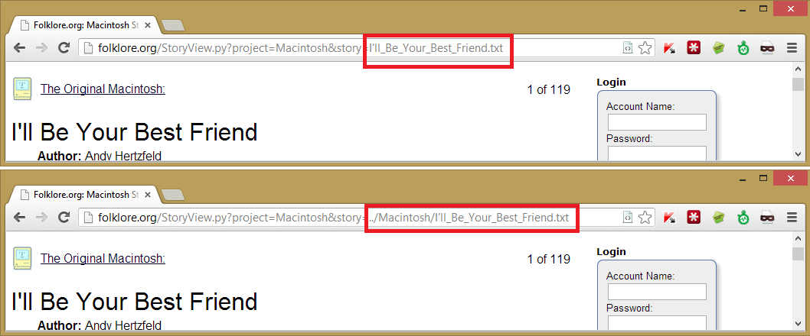

tl;dr Never trust user input.

*Note: Before I published this I contacted [the owner](https://en.wikipedia.org/wiki/Andy_Hertzfeld) of the site and he has since replaced it with a new and more secure version*

When I browse the net I often see the hallmarks of a security issue with websites that I visit, and little alarm bells go off in my head. I was recently browsing a site called [folklore.org](https://www.folklore.org/), which documents folklore regarding the early days of Apple, when these bells started going off big time. I found many classic security issues on the site (and managed to get a shell) and this post explains the how I found them as well as what you can do to prevent these exploits.

### Local file inclusion, arbitrary writing of files insecure file uploads
These are the most interesting exploit I found. The first thing I noticed about the site was that a filename appeared in a GET parameter - this is a classic sign of a [File Inclusion Vulnerability](https://en.wikipedia.org/wiki/File_inclusion_vulnerability). You can generally test if the website sanitizes the filename correctly by doing this:

Two requests were sent, one with filename.txt and one with ../Macintosh/filename.txt (Can be subsituted with ./filename.txt). If the website was not properly validating the input and merely appending the filename on the end of a file path then both pages should be the same, which they are. The website was essentially doing this:

    <?php send_file("C:/my_website/files/Macintosh/" . $GET['file_name'] ?>

which is insecure, because a malicious user could send "../../secret.txt" as the filename parameter, which would send the file "C:/my_website/files/Macintosh/../../passwords.txt" to the user. Because "../" in a path goes back a directory this path is the same as "C:/my_website/passwords.txt". I couldn't get this LFI to work and I ran out of patience (I later found it was possible, but a bit convoluted).

You should never trust user input. If you are expecting a filename as a parameter (why?) then always validate that it is only a filename with no directory component, an appropriate extension and that the user has access to such a file.

#### Getting a shell

Another feature of the site is the ability to add your own posts, I thought that if they don't validate path names here then they probably don't validate when creating posts either. You could create a article called ../test.txt and it would create a file containing the contents in the directory below the one it was supposed to.

I thought I could create an article called ../../HackedView.py and fill it with some python code that would fork itself and get me a reverse shell (and that would be worth writing about), but it was not possible. Instead I cheated and simply uploaded a PHP shell as an attachment 

This shell simply displays a directory listing. I uploaded another one that let me read files, and I could then access the entire sites source code. Securing uploads is a must on any web application - ensure uploaded files are not executable (chmod) and have a proper extension (nobody needs to upload .php files to an image gallery).

### Cross Site Scripting
[Cross Site Scripting](https://en.wikipedia.org/wiki/Cross-site_scripting) (or XSS for short) is the [second most dangerous web-app security issue](https://www.owasp.org/index.php/Category:OWASP_Top_Ten_Project), and it's very common. When you accept input from a user that is possibly going to be displayed to them in the future, like a comment, or in the response to the request then it should always be sanitized and stripped of HTML tags. Code like the PHP below is vulnerable to XSS because a user could send the name "&lt;script&gt;alert('hello there')&lt;/script&gt;" which would cause an alert box to pop up on their screen. 

    <?php echo "Hello " . $_GET['name'] ?>

This itself isn't dangerous, but a criminal mastermind could put _any_ code he wanted in the name parameter and send the link to someone unwitting. When they clicked it the code would execute in the context of the web-page, doing any number of malicious things. 

There are two types of XSS, _stored_ and _reflective_: __Reflective XSS__ is described above and happens only when someone makes a crafted request, like a search:

 
The error message is Chrome preventing the XSS code from executing, because it's clever like that. Other and older browsers won't have this protection, or it could be circumvented so it's still an issue.

__Stored XSS__ happens when the code is saved somewhere, perhaps to a database, and is then sent back every time someone views a specific page, and on this site it was in the comments box:

Adding a comment like this meant that any time someone viewed that article with the malicious comment in it this would appear:

### Bounds checking
Each article on the site could be rated from 1 to 5, and an average would be displayed to the user. I found that the site wasn't properly validating the rating that was sent from the user - you could quite easily send a rating of 10 (as shown below). This unfortunately caused the article page to become un-viewable (it would only respond with a 500 error).

You should *never* trust user input in a web application no more than a bank teller should trust a customer when he says he has enough money in his account for a withdrawal and not to bother checking. Always ensure that it matches what you expect or display an error message. 
    