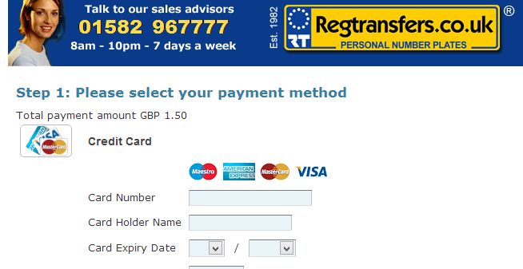

[Regtransfers.co.uk](https://regtransfers.co.uk) is a website that allows you to purchase customized numberplates for your car or motorbike. They boast a large number of famous clients and short numberplates are often on sale for upwards of £20,000 (the plate ABC 4 is up for £30,000). While playing with their site I discovered a flaw that would allow anybody to purchase that ABC 4 plate for an arbitrary price. As always I waited until the issue was fixed on the site before publishing this post.

#### The order process
The order process is simple and painless. You search for a numberplate and browse ones available for purchase. Once you have found one that you like you select "Buy" and you are taken to a page where you can enter your personal details:

Within the order page there is a form element with some interesting names:

Surely the site would validate the input to ensure no negative values could be added?

Or not

And finally the payment page:

I would have certainly been able to complete the payment but whether or not the order would have succeeded depends on how automated regtransfers.co.uk is. I doubt it's completely automated so I expect someone along the line would have flagged this up and stopped the transfer, but who knows? This goes to show that while using a framework can protect you against common flaws like SQL injection or XSS business logic still needs to be tested and inputs still need to be validated.
    