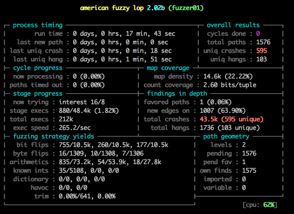
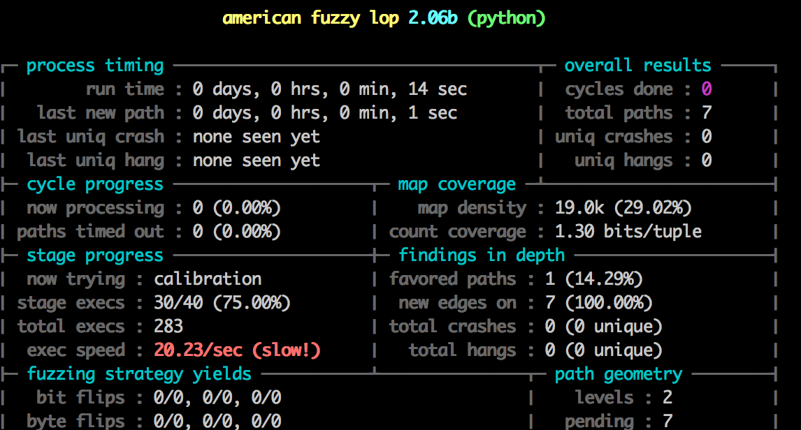

American Fuzzy Lop is both a [really cool tool for fuzzing programs](https://lcamtuf.coredump.cx/afl/) and an [adorable breed of bunny](https://www.google.co.uk/search?tbm=isch&source=hp&q=American+Fuzzy+Lop). In this post I'm going to show you how to get the the tool (rather than the rabbit) up and running and find some crashes in the cPython interpreter.



### Fuzzing?

Explaining in detail what fuzzing is would be a post in itself, so here is [the summary from the Wikipedia article](https://en.wikipedia.org/wiki/Fuzz_testing)

<blockquote>
Fuzz testing or fuzzing is a software testing technique, often automated or semi-automated, that involves providing invalid, unexpected, or random data to the inputs of a computer program. The program is then monitored for exceptions such as crashes, or failing built-in code assertions or for finding potential memory leaks. Fuzzing is commonly used to test for security problems in software or computer systems. It is a form of random testing which has been used for testing hardware or software.
</blockquote>

In laments terms it might be the equivalent of "throwing enough shit at a wall and to see what sticks". For example if you have a program that plays MP3 files written in an unsafe language like C/C++ fuzzing might involve taking a valid MP3 file and changing parts of the file and then attempting to play it. If the MP3 player works correctly any invalid files will result in an error, whereas if it is coded incorrectly the program will crash. Repeat this 1,000,000 times and you might find a lot of different bugs.

That's the long and short of it. AFL has [some really clever tricks up its sleeve](https://lcamtuf.blogspot.co.uk/2014/08/binary-fuzzing-strategies-what-works.html) to make this process more efficient to the point where it can [make up JPEG images from just running a JPEG parser](https://lcamtuf.blogspot.co.uk/2014/11/pulling-jpegs-out-of-thin-air.html) or [write valid Bash scripts](https://lcamtuf.blogspot.co.uk/2014/10/bash-bug-how-we-finally-cracked.html). That's pretty awesome and made me want to have a crack at the Python, specifically the cPython interpreter.

### Setting up afl-fuzz

For best results use Linux - OSX has some performance issues that make afl really slow and Windows isn't supported. The instructions below assume Ubuntu since that's what I used.

Downloading and compiling afl was really painless. Other than `build-essential` I didn't have to install any dependencies.

    ➜ ~ sudo apt-get install build-essential
    ➜ ~ wget https://lcamtuf.coredump.cx/afl/releases/afl-latest.tgz
    ➜ ~ tar xvf afl-latest.tgz && cd afl-2.06b
    ➜ ~ make -j8

After building the project with make you will have a few executables in the current directory including `afl-gcc`, `afl-fuzz` and `afl-whatsup`.

### Fuzzing Python

Now we have our `afl-fuzz` executable we need to make a program for it to fuzz. To enable afl to fuzz a program it must meet two requirements: be compiled with `afl-gcc` (or `afl-g++`) and accept a file name through a command line parameter (or the data via stdin - no sockets for example). When afl starts fuzzing it generates testcases using something akin to black-magic, then writes each case to a file in a directory. It then invokes the target program with the path to that file, e.g `my-program /afl/testcase1`. The target should then read the file and do something with it, and because it is compiled with the special `afl-gcc/g++` compilers `afl-fuzz` is able to understand what parts of the program executed. If it sees one testcase made the program execute in a new way it starts building new ones around that, allowing it to slowly map out large portions of the target and in theory find edge-cases that cause it to crash.

So I reasoned the simplest way to do this was just download the cPython source code, compile the interpreter with `afl-gcc` and then run it through `afl-fuzz`. The stock interpreter executes code from a file because that's what its built to do. Let's go grab the source code:

    ➜ ~ sudo apt-get install mercurial
    ➜ ~ cd ~
    ➜ ~ hg clone https://hg.python.org/cpython
    ➜ ~ cd cpython
    ➜ ~ hg checkout 3.5
    ➜ ~ CC=~/afl-2.06b/afl-gcc ./configure && make -j8

The configure script reads the name of the C compiler from an environment variable `CC`. By passing `CC=~/afl-2.06b/afl-gcc` you're telling it to use `afl-gcc` as the C compiler to build the interpreter. If you've done it right you should see lines line this in the output:
  
    afl-as 2.06b by <lcamtuf@google.com>
    [+] Instrumented 97 locations (64-bit, non-hardened mode, ratio 100%).
    ../afl-gcc -pthread -c -Wno-unused-result -Wsign-compare -Wunreachable-code -DNDEBUG -g -fwrapv -O3 -Wall -Wstrict-prototypes    -Werror=declaration-after-statement   -I. -IInclude -I./Include    -DPy_BUILD_CORE -o Parser/grammar.o Parser/grammar.c
    afl-cc 2.06b by <lcamtuf@google.com>

So now we have our special interpreter we have one more thing to do before we run it through `afl-fuzz`: make some test cases. `afl-fuzz` works best if you give it some example programs to initially work with, so create some files in a directory like `~/python_testcases` and fill them with simple Python syntax constructs, e.g:

```python
class ABC(object):
    def x(self):
        for i in range(10):
            y = i + 2
            yield y

o = ABC()
yield from o.x()
```


Then invoke `afl-fuzz` like so:

    ➜ ~ ~/afl-2.06b/afl-fuzz -i python_testcases -o fuzz cpython/python @@

You should see a screen like the one below:




### Fuzzing Python *fast*

Notice something about the image above?


Damn. That's terrible. We are never going to get anywhere with 20 executions a second - we need millions and millions to get good results. Lucky for us there is a trick we can use to greatly improve that speed.

#### Use `llvm-mode` and Python Bytecode files

Currently our target program is the CPython interpreter itself which has a bit of a large startup overhead. This includes reading the user environment, possibly executing a users `site.py` file etc. This is slow. We are also trying to feed it actual Python code which has to be parsed into bytecode before being executed, which is also an avoidable overhead. CPython actually stores these parsed bytecode files on disk as `file_name.pyc` in 2 and inside  a `__pycache__` directory in 3. These are just an optimization so that the interpreter doesn't have to constantly re-parse the source files. But the interpreter can execute them directly, and `afl-fuzz` happens to be work much better when working with binary formats over textual ones. To avoid the startup and parsing overhead we need to make a stripped down interpreter. 

I've never actually written anything more than "hello world" in C so this was a bit of a learning curve. After reading the Python C documentation I figured the best way to go is to use [PyRun_AnyFileEx](https://docs.python.org/3.5/c-api/veryhigh.html#c.PyRun_AnyFileEx). I made a new file inside `cpython/Programs/` called `test.c` where I put the code my stripped down program and after a bit of tinkering I wrote the following C:

```c
#include <Python.h>
#include <stdio.h>

int main(int argc, char *argv[])
{
    Py_NoSiteFlag = 1;
    Py_InitializeEx(0);
#ifdef __AFL_HAVE_MANUAL_CONTROL
    __AFL_INIT();
#endif
    FILE *f = fopen(argv[1], "rb");
    if(PyRun_AnyFileEx(f, argv[1],1 ) == -1) {
        printf("fail");
    }

    Py_Finalize();
    return 0;
}
```

The `_AFL_INIT()` code above is a special experimental feature of `afl` that greatly increases the speed of our fuzzing. In short it enables you to 'defer initialization' of afl until *after* an expensive initialization that the program has to execute. In this case the `PyInitializeEx` function is pretty slow so we place the `__AFL_INIT()` function after it, so that when afl is fuzzing the program it gets started from **after** `Py_InitializeEx` is called. This skips repeating the slow startup and speeds fuzzing up a lot, because we want to fuzz the `PyRun_AnyFileEx` function and not waste type running `PyInitializeEx()` over and over again. To enable this you have to compile a special afl tool called `afl-clang-fast`:

    ➜ ~ pushd ~/afl-2.06b/llvm_mode/
    ➜ ~ sudo apt-get install clang llvm-dev llvm
    ➜ ~ make
    ➜ ~ popd

And then run `./configure` again with `afl-clang-fast` instead of `afl-gcc`:

    ➜ ~ CC=~/afl-2.06b/afl-clang-fast CXX=~/afl-2.06b/afl-clang-fast++ ./configure

This is optional though, it works fine without it.

After all this we have our target program, we need to make it build. Getting this bit working took a while because I had no idea what I was doing. In the end I manually added some code this code to the `$(BUILDPYTHON)` Makefile target:

    # Build the interpreter
    $(BUILDPYTHON): Programs/python.o $(LIBRARY) $(LDLIBRARY) $(PY3LIBRARY)
        $(LINKCC) $(PY_LDFLAGS) $(LINKFORSHARED) -o $@ Programs/python.o $(BLDLIBRARY) $(LIBS) $(MODLIBS) $(SYSLIBS) $(LDLAST)

        # New lines here:
        $(MAINCC) -c $(PY_CORE_CFLAGS) -o $(srcdir)/Programs/test.o $(srcdir)/Programs/test.c
        $(LINKCC) $(PY_LDFLAGS) $(LINKFORSHARED) -o Programs/test Programs/test.o $(BLDLIBRARY) $(LIBS) $(MODLIBS) $(SYSLIBS) $(LDLAST)

Yes, this is probably really horrible and not a good way to do this but it works. After running `make -j8` you will have a file called `test` located inside `Programs`. If `make` errors don't worry, as long as the file is there then it will execute fine.

### Running `afl-fuzz`

We have everything set, lets find some crashes. Compile your python testcases to pyc files with this command:

    ➜  ~ python3.4 -m compileall python_testcases
    ➜  ~ cp python_testcases/__pycache__/* python_testcases
    ➜  ~ mv python_testcases/*.py .

And then execute `afl-fuzz`. The `-f input.pyc` flag forces the input file to have the extension `pyc` which is required by Python when running `pyc` files:

    ➜  ~ afl-2.06b/afl-fuzz -i python_testcases -o fuzz -f input.pyc cpython/Programs/test @@

You should see the following screen:


Notice the speed: `373.4/sec`, up from 20! And we've already found 100 unique crashes!

And to just confirm that those crashes are real and not because of our special program we can try them on the system `python`:


    ➜  ~ cp fuzz/crashes/id:000000,sig:11,src:000000,op:flip1,pos:13 test.pyc
    ➜  ~ python3.5 test.pyc
    [1]    3689 segmentation fault  python3.5 test.pyc


It's worth pointing out here that this isn't really a problem or any kind of security risk. `pyc` files are internal to cPython and not many validation checks are run on them. If you're in a position to send someone malicious `pyc` code that crashes an interpreter a far more malicious thing would be to simply execute `__import__('shutil').rmtree('/', ignore_errors=True)` rather than crash the process.


## Conclusion

So we've got afl-fuzz to find some real life crashes in the cPython interpreter, through fuzzing it's bytecode. We've also discovered that there are a *lot* of crashes and that the interpreter doesn't really protect itself against invalid bytecode, which takes a bit of the fun away.

The next step is to fire up a debugger like `gdb` and use it to explore **why** the bytecode crashes the interpreter. I'm going to write a post on how to do this in the near future because it's quite lengthy and this post is already long enough, but as a sample the first segfault afl found [was in this code](https://github.com/python/cpython/blob/e5dab99584e07ee64ec3551fdf1709e175c31cd6/Objects/codeobject.c#L109):

```c
for (i = 0; i < n_cellvars; i++) {
    Py_ssize_t j;
    PyObject *cell = PyTuple_GET_ITEM(cellvars, i);
    for (j = 0; j < total_args; j++) {
        PyObject *arg = PyTuple_GET_ITEM(varnames, j);
        if (!PyUnicode_Compare(cell, arg)) {
            cell2arg[i] = j;
            used_cell2arg = 1;
            break;
        }
    }
}
```

The issue is that the line `PyObject *arg = PyTuple_GET_ITEM(varnames, j);` can be null if `varnames` is an empty tuple (which it can be if the pyc file is malformed). No null check is done on `arg`, which is passed to `PyUnicode_Compare` and this causes a segfault.
    