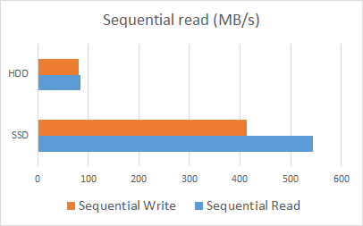

I recently brought a [Samsung 840 Series Pro 256GB 2.5 inch SATA Solid State Drive](https://www.amazon.co.uk/gp/product/B009LI7CTY/ref=as_li_qf_sp_asin_tl?ie=UTF8&camp=1634&creative=6738&creativeASIN=B009LI7CTY&linkCode=as2&tag=tomscorneofth-21) and its easily the best PC hardware purchase I have ever made. Before I purchased it I was thinking about replacing my laptop as it was getting pretty sluggish, despite having decent specs even 2 years after I purchased it. After I installed the SSD alongside one of the original hard disks the laptop became blazing fast - it boots to the Windows 8 home screen in under 4 seconds which is faster than my Chromebook (a product designed from the ground up to boot as fast as possible).

### Benchmarks
The drive came with some software from Samsung to do various things with the drive, including benchmark it. At first I thought the software was just another bit of bloatware but it's actually quite useful and well designed. I used it to benchmark the SSD (my OS drive) and the other 500gb spinning drive:

My old spinning disk barely managed to scrape 250 random IO operations a second, whereas the SSD blasted ahead with nearly **65,000**. That's 260x more random reads! The net result of this is everything is pretty much instant: the boot, visual studio, Chrome etc. It's like having a new laptop again.

#### The upsides
Price - while £180 might seem like a lot for a 256GB disk its well worth it if only for the speed. SSD prices will continue to drop, you can pick a <a href="https://www.amazon.co.uk/gp/product/B00DJ1CQSG/ref=as_li_ss_tl?ie=UTF8&camp=1634&creative=19450&creativeASIN=B00DJ1CQSG&linkCode=as2&tag=tomscorneofth-21">SanDisk 256GB disk for only £124</a>. Hopefully sub £100 256GB SSD's will be out soon which would really drive adoption.

Speed - If we [multiply the disk read times by a billion](https://gist.github.com/hellerbarde/2843375) reading 1MB sequentially from a spinning disk would take 7.8 months (up to a whole year if you include a disk seek). Reading the same from a SSD would take 11.6 days.

Power - SSD's don't have any spinning parts such as a motor and so draw much less power. This can mean a big boost in battery life for Laptops such as mine (up to half an hour extra)

#### The downsides
Capacity - 256GB doesn't seem like much, and it isn't if you have a lot of movies, music and pictures. I would recommend using this SSD along with a higher-capacity spinning drive to store all your large stuff, leaving the SSD for the operating system and applications.

#### The software
The software deserves its own section. It allows you to benchmark your disk (and any other attached disk), optimize your OS for several different use cases (performance, capacity or resilience) and upgrade the firmware. Its genuinely quite cool and I wish all pre-bundled software was as good as this. The screenshot below is a random one I found on the internet:

    