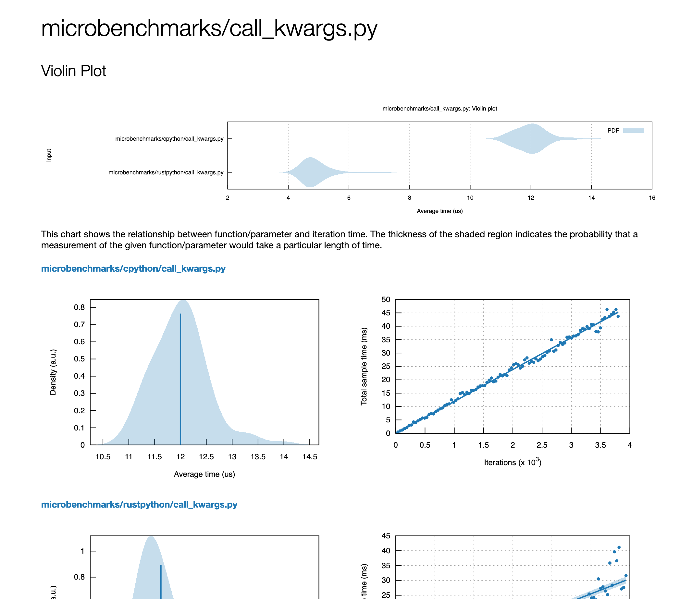
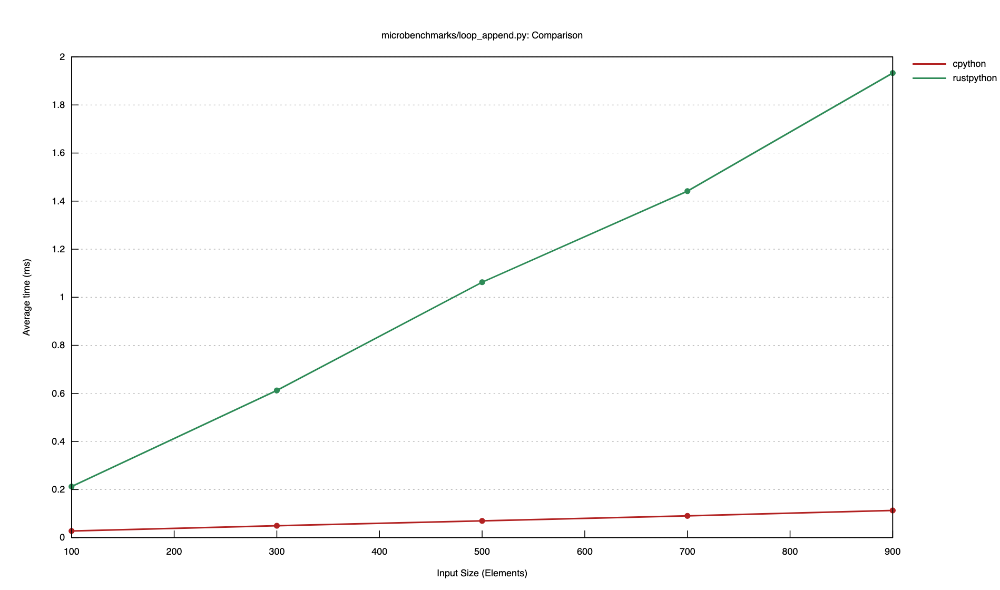
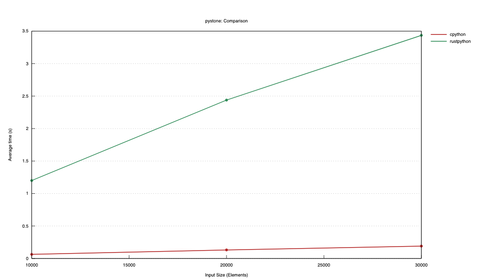

I've been very excited about [RustPython](https://github.com/RustPython/RustPython) since I saw the project 
being [presented at FOSDEM 2019](https://archive.fosdem.org/2019/schedule/event/rust_python/). Last week I finally
got [to contributing something to the project](https://github.com/RustPython/RustPython/pull/2367/)!

For context, RustPython benchmarks specific Python files against CPython, the "reference implementation" for Python  
(read: the only real implementation that matters). These files are varied, including the PyStone benchmark, a 
mandlebrot implementation and the `nbody` algorithm used by the [Computer Language Benchmarks Game](http://benchmarksgame.alioth.debian.org/).

# Refactoring the benchmark suite

RustPython used the standard [Rust Benchmarking features](https://doc.rust-lang.org/1.7.0/book/benchmark-tests.html), 
but this was not ideal for a few reasons:

1. Benchmarks require rust nightly to run 😱
2. They are quite inflexible
3. Adding new benchmarks required adding a new `#[bench]` function, just like adding a new test

The ideal state is one where benchmarking is as simple and flexible as possible. Simply adding a `.py` file to a 
directory should be all you need to run benchmarks.

## Adding criterion

Criterion is a great foundation to build to our ideal state. After following the [user guide](https://bheisler.github.io/criterion.rs/book/getting_started.html) 
I got a simple benchmark running very quickly:

```rust
// The file contents to benchmark 
const MANDELBROT: &str = include_str!("./benchmarks/mandelbrot.py");

fn bench_cpython_code(bench: &mut Bencher, source: &str) {
    // Start the Python interpreter
    let gil = cpython::Python::acquire_gil();
    let python = gil.python();

    // Run the given source code in a loop
    bench.iter(|| {
        let res: cpython::PyResult<()> = python.run(source, None, None);
        if let Err(e) = res {
            e.print(python);
            panic!("Error running source")
        }
    });
}

fn bench_rustpython_code(bench: &mut Bencher, source: &str) {
    // Create our interpreter
    rustpython_vm::Interpreter::default().enter(|vm| {
        // Compile and run our source in a loop
        bench.iter(|| {
            let code = vm.compile(source, Mode::Exec, name.to_owned()).unwrap();
            let scope = vm.new_scope_with_builtins();
            let res: PyResult = vm.run_code_obj(code.clone(), scope);
            vm.unwrap_pyresult(res); 
        })
    })
}

pub fn criterion_benchmark(c: &mut Criterion) {
    let mut group = c.benchmark_group("execution");
    group.bench_function(BenchmarkId::new("mandlebrot.py", "cpython"), |b| bench_cpython_code(b, MANDELBROT));
    group.bench_function(BenchmarkId::new("mandlebrot.py", "rustpython"), |b| bench_rustpython_code(b, MANDELBROT));
    group.finish();
}

criterion_group!(benches, criterion_benchmark);
criterion_main!(benches);
```

There is a fair bit of code here, especially if you're not used to Criterion. If we strip away the benchmark specific 
stuff we get the following, which is a lot simpler to read:

```rust
fn bench_cpython_code(bench: &mut Bencher, source: &str) {
    bench.iter(|| do_something);
}

fn bench_rustpython_code(bench: &mut Bencher, source: &str) {
    bench.iter(|| do_something);
}

pub fn criterion_benchmark(c: &mut Criterion) {
    let mut group = c.benchmark_group("execution");
    group.bench_function(BenchmarkId::new("mandlebrot.py", "cpython"), |b| bench_cpython_code(b, MANDELBROT));
    group.bench_function(BenchmarkId::new("mandlebrot.py", "rustpython"), |b| bench_rustpython_code(b, MANDELBROT));
    group.finish();
}

criterion_group!(benches, criterion_benchmark);
criterion_main!(benches);
```

The essence of Criterion is that you define a function, `criterion_benchmark` that receives a `Criterion` structure. 
With that you can create many benchmark groups, and within a group you can benchmark many different functions. 

After running `cargo bench` Criterion will output a pretty detailed HTML report showing the differences between the 
two implementations. For example:



## Making it dynamic

One of the things we really want is to allow adding new benchmarks really easily. We can modify our benchmark code 
to iterate over a directory and create benchmarks on the fly:

```rust
use glob::glob;

pub fn criterion_benchmark(c: &mut Criterion) {
    let mut group = c.benchmark_group("execution");

    for entry in glob("benchmarks/*.py").unwrap() {
        let file_name = entry.unwrap().display();
        let code = std::fs::read_to_string(entry).unwrap();
        group.bench_function(BenchmarkId::new(file_name, "cpython"), |b| bench_cpython_code(b, &code));
        group.bench_function(BenchmarkId::new(file_name, "rustpython"), |b| bench_rustpython_code(b, &code));
    }
    group.finish();
}
```

## Adding microbenchmarks

Microbenchmarks are more complex because they are usually split into "setup" and "benchmark" components. To keep things 
flexible and simple I decided to use `# ---` as a delimiter between the two components. For example the following 
snippet would only benchmark the time it takes to construct an instance of the `Foo` class and not the time it takes 
to _define_ the `Foo` class:

```python
class Foo:
    pass

# ---

Foo()
```

## Adding loops

Another key feature is loops: timing raw execution speed is good, but you probably want to see how it performs with 
varying sized inputs. For this I decided to simply detect if the string `ITERATIONS` is present in either the setup 
or benchmark code, and if so inject a local Python variable with an appropriate value. For example this code benchmarks 
the time it takes to append an integer to a list:

```
obj = []

# ---

for i in range(ITERATIONS):
    obj.append(i)
```

We can modify the Criterion harness to detect this:

```rust
let file_name = entry.unwrap().display();
let code = std::fs::read_to_string(entry).unwrap();

if code.contains("ITERATIONS") {
    for idx in (100..=1_000).step_by(200) {
        group.throughput(Throughput::Elements(idx as u64));
        group.bench_with_input(BenchmarkId::new("cpython", idx), |b| bench_cpython_code(b, &code, idx));
        group.bench_with_input(BenchmarkId::new("rustpython", idx), |b| bench_rustpython_code(b, &code, idx));
    }
}
```

If you configure this correctly then Criterion will create a lovely plot showing the performance related to the input:



## The results

You can check out the [RustPython benchmarks readme.md](https://github.com/RustPython/RustPython/tree/9b76dc38d8002ed8bb49d0a65b0660f7f2f6f4ca/benches#usage) 
for a full rundown of the changes. But here is a lovely graph showing the `pystone` comparison between cPython and 
RustPython. It seems we have some way to go before performance parity!


