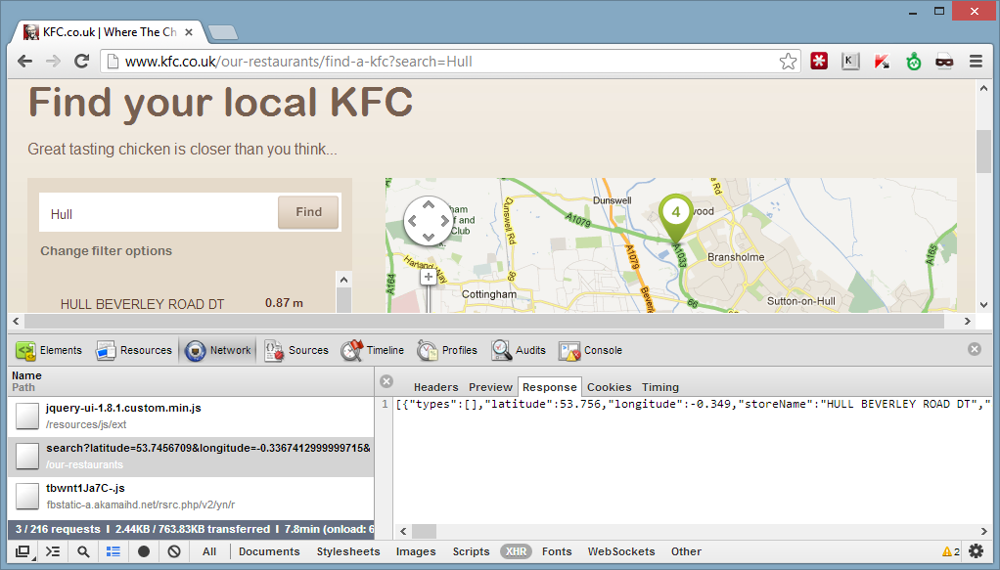

I think I just solved a very first world problem - Where to find the nearest takeaway that sells fried chicken.

When you are stumbling out of [Spiders](https://www.urbandictionary.com/define.php?term=Spiders%20Nightclub) at 1am in the morning and craving some SFC goodness the last thing you want to do is wander the backstreets of hull in the cold looking for an open takeaway. Clearly an app was needed that could display a list of open nearby takeaways that sells fried chicken with the fastest route to it. This was originally a joke project of mine but it became pretty involving, and I learned a lot that might be useful to anyone interested in C# web services, parsing HTML, reverse engineering web applications and running .NET on Linux with Mono.

### Architecture
A lot of [screen scraping](https://en.wikipedia.org/wiki/Data_scraping#Screen_scraping) was required so both a server and a phone app were necessary. The phone app should be as simple as possible: it would use the location service to find the users' co-ordinates then send them to the server, which would be responsible for finding chicken from a variety of different sources and returning the reduced results.

There are two main reasons for needing a separate server to handle the searching logic: the sources being searched can be changed or fixed without needing to issue an update on the phone marketplace. The searching itself is pretty network intensive, requiring many network calls which is not suitable on a phone network that is normally high-latency and low bandwidth.

The server would have to be modular (each source of restaurant information should be in a separate class) and when a client makes a search each of the modules are called in parallel and return information. The reduced results are then serialized and sent to the client. 

### Information Sources
I identified 3 main sources of information on local chicken establishments:

 * [just-eat.co.uk](https://Just-Eat.co.uk)  [(code)](https://github.com/orf/FindMeChicken-mono/blob/master/FindMeChicken-ASP/Sources/JustEatAPI/JustEatAPISource.cs#L48)
 * [hungryhouse.co.uk](https://hungryhouse.co.uk/)  [(code)](https://github.com/orf/FindMeChicken-mono/blob/master/FindMeChicken-ASP/Sources/HungryHouse/HungryHouseSource.cs#L102)
 * [kfc.co.uk](https://www.kfc.co.uk/our-restaurants/find-a-kfc?search=Hull) [(code)](https://github.com/orf/FindMeChicken-mono/blob/master/FindMeChicken-ASP/Sources/KFC/KFCSource.cs#L35)

#### KFC
The KFC website was the simplest to implement: their site has a "Find your local KFC" section where you can enter your location and it will show a map with local KFC's and your distance from them. I opened up Chromes' development console (F12) to see how it was getting this information. After navigating to Network->XHR and refreshing the page I discovered it was making an ajax request to find the locations:

The users browser sends a request to a URL like this: [ https://www.kfc.co.uk/our-restaurants/search?latitude=53.7456709&longitude=-0.3367412999999715&radius=10]( https://www.kfc.co.uk/our-restaurants/search?latitude=53.7456709&longitude=-0.3367412999999715&radius=10&storeTypes=) which returns a JSON array with information on local KFC's.

I used the extremely useful [Json.Net](https://www.nuget.org/packages/Newtonsoft.Json) library to parse the JSON response from this API. This library is brilliant when combined with C#'s dynamic keyword, for example the snippet below parses a response from the KFC website then writes all the found storenames and phone numbers to the console:

    dynamic converted_data = JsonConvert.DeserializeObject<List<dynamic>>(kfc_response_data);
    foreach (var entry in converted_data)
    {
        Console.WriteLine(entry.storeName);
        Console.WriteLine(entry.phoneNumber);
    }

#### Just-Eat
Just-Eat was possibly the hardest to implement and took me quite a while to crack. It only accepts postcodes, this means the webservice needs to translate the latitude and longitude that the phone application sends it into a postcode: this is called [Reverse Geocoding](https://en.wikipedia.org/wiki/Reverse_geocoding). It is impossible to implement yourself with any degree of accuracy - thankfully there are a few services that offer this functionality, namely [Yahoos' GeoFinder](https://developer.yahoo.com/boss/geo/) and [Googles' Geocoding API](https://developers.google.com/maps/documentation/geocoding/). Word on the street as far as I could find is that Googles' API is superior quality, but must be associated with a "Google maps view". Yahoo however has a 'good enough' API with  generous free limits. Bing also offer a Geolocation service - which [I implemented](https://github.com/orf/FindMeChicken-mono/blob/master/FindMeChicken-ASP/Lib/BingMaps.cs) - but I found that sometimes the service would not return any results until you made the request again. Screw it.

[I coded a mostly working](https://github.com/orf/FindMeChicken-mono/blob/master/FindMeChicken-ASP/Sources/JustEat/JustEatSource.cs) (if not a bit temperamental) module that scraped the HTML from the just-eat website using the [HTMLAgilityPack](https://nuget.org/packages/HtmlAgilityPack) library. HtmlAgilityPack has quite a nice API which revolves around using XPath queries to navigate through the document tree. The snippet below iterates through any **li** tag which has a class that contains the string 'cat':

    var page = new HtmlDocument();
    page.Load("https://www.mywebsite.com/afile.html");
    foreach (var node in page.DocumentNode.SelectNodes(".//li[contains(@class,'cat')"))
    {
        Console.WriteLine("li tag found: ID = {0}", node.Attributes["id"]);
    }

Extracting information from websites by parsing their HTML is prone to breaking: in the example above if the web owner changed all his **li** tags to **div**'s then the code would break and have to be fixed. 

Soon after I got the screen scraping code mostly working I did notice that they had an iPhone app that didn't use their website. This means that the app must be getting its data from somewhere else, and it must be from some form of API. So I installed it on my girlfriends iPhone and configured its proxy settings to point to my laptop so I can inspect any network traffic the app sends. After opening the app and running the excellent [Burp suite](https://www.portswigger.net/burp/) on my computer I saw the following requests were being made:

So it looked like Just-Eat did have an API after all. After having a poke around I found that they helpfully have a [Web Services Defintion Language file](https://en.wikipedia.org/wiki/Web_Services_Description_Language) which Visual Studio can use to generate client code. This code interacts with their API. Importing the WSDL file into VS2012 was easy: Simply right click a project in Visual Studio, select "Add Service Reference" and input "[https://api.just-eat.com/MenuApi.svc?wsdl=wsdl0](https://api.just-eat.com/MenuApi.svc?wsdl=wsdl0)" into the Address field. Visual Studio discovers all of the methods available and the parameters and generates classes that match them. You can view the code that uses the API [here](https://github.com/orf/FindMeChicken-mono/blob/master/FindMeChicken-ASP/Sources/JustEatAPI/JustEatAPISource.cs), it really is much nicer to look at and much more maintainable than the HTML parsing version.

Just-Eat also doesn't give any geographical co-ordinates of its restaurants, only an address. Therefore to work out the distance from the user to the restaurants the address has to be turned into a latitude and longitude. I used Yahoo's Geocoding service to do this.

#### HungryHouse
HungryHouse was certainly much less effort to implement than Just-Eat. It offers a keyword search, so the server searches for "Fried chicken" and returns all open restaurants. Also the latitude and longitude of the restaurants is displayed on the page in the form of a map centered around a point, which means on average less Geocoding requests need to be made.

### Mono
Deploying to mono was mostly painless, although I had to switch to an Ubuntu server rather than my preferred CentOS because it has a proper mono package that can just be installed by 'apt-get install mono-complete'. Mono comes with several useful tools that helped me test my code: xbuild and xsp4. XBuild is run in the root of your solution and it builds it, reading the .sln file, which meant I could just commit from my windows machine and it would build on Linux without any effort, which is nice. I did run into some dependency issues: nuget can be run on mono to download the dependencies automatically, but for some reason it didn't want to locate them after they had downloaded so they had to be manually added to the /bin file to work. Xsp4 is mono's development webserver which is run in the root of your ASP.net site to start serving, and while it can't handle production traffic it's handy while debugging.

One weird thing with mono is the web service reference I added for the Just-Eat source didn't seem to work. I had to remove the reference and use code that the linux 'wsdl' (a tool that comes with mono for generating C# code from WSDL files) program generated.

ChickenChecker should be hitting the marketplace soon. Watch this space.
    