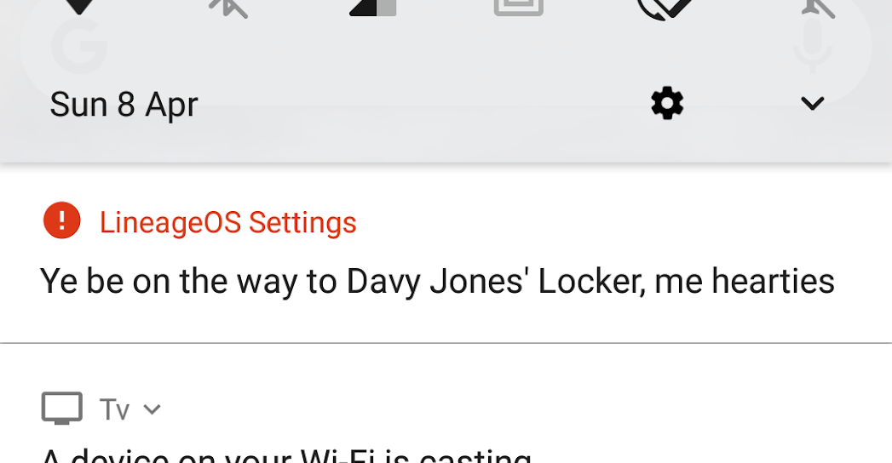

Picture the scene. You've recently installed the awesome [Lineage OS](https://www.lineageos.org/)
on your android device and are enjoying it so far. You install an update, it all goes smoothly, but
upon restarting you are presented with this notification:

What

You press on the notification and you're taken to the Lineage changelog for that release, which doesn't mention anything to
do with pirates or anything like that. The notification is also to be persistent.

*What*

Turns out it's [part of their april fools joke, and it's confusing other users](https://forum.xda-developers.com/lineage/help/lineage-os-message-update-t3772397).
The recommended way of removing it is re-flashing your device or executing a command after rooting it.

**What**

I've got nothing against april fools jokes, but this one is pretty ridiculous. Firstly, there is no context: Why is the
notification an alert one? Why the hell is it in pirate-speak **for no reason**? Why can't you get rid of it without
rooting your device? Also, if it's an april fools joke, *where is the humour*. Pirate speak by itself isn't funny.

This just seems really quite user-hostile and I'm not impressed.
[Neither are other people](https://www.reddit.com/r/LineageOS/comments/89f76y/can_we_have_a_serious_talk_about_april_fools/)