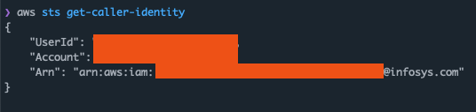



### Infosys has a lot to say about security

You can check out [their website for a lot of buzwords](https://www.infosys.com/services/cyber-security.html), but it's 
clear from all the stock photos that they take security Very Seriously Indeed ™️. 

However, from what I've found recently, it seems that InfoSys follow the following Comprehensive Management-Endorsed 
Proficiently Driven Cybersecurity Strategy and Framework items:

- Don't use AWS roles or temporary credentials for your developers
- Instead, use IAM user keys and give them all `FullAdminAccess` permissions
- Never rotate these keys and store them as plaintext in git
- Use these keys to protect what appears to be medical data about COVID patients
- Have someone publish those keys and the code in a public package to pypi
- Keep those keys active for days after leakage
- Make nonsensical pull requests to try and remove all references to the leak





### The Leak

This morning I woke up to a very [strange pull request](https://github.com/orf/pypi-data/pull/2) on my [pypi-data](https://github.com/orf/pypi-data) project. 
This project contains metadata for every package published on PyPi ([e.g Flask](https://github.com/orf/pypi-data/blob/main/release_data/f/l/flask.json)), 
and it exists because querying the data from PyPi in bulk was annoying and I didn't want to [use BigQuery](https://warehouse.pypa.io/api-reference/bigquery-datasets.html). 

The user was attempting to delete a project called `ihip`. Looking at the file they where trying to remove, it seemed 
to be an internal package that was published by mistake on the 2nd of February **2021**. The metadata of the package 
referenced the internal infosys Github instance as it's homepage, but otherwise looked pretty innocuous.

It seems my project didn't correctly account for complete packages that have been deleted from PyPi - my bad! I'm not 
sure how to handle that to be honest - once the package is published the metadata is out there. 

Out of interest I downloaded the publicly available release file that was specified in the metadata and found 
something interesting.





### The Keys

At the top of the file, embedded as string constants, was an AWS access key and AWS secret key. The rest of the code 
seemed to be interacting with a S3 bucket in pretty standard ways: pulling data, loading it into pandas and computing 
some basic aggregates. It seems like this code came from an internal Github instance inside Infosys and was accidentally 
published.

I assumed the key had been revoked (it's been public for over a year!), but to my great surprise I found it was still 
active!





### The Bucket

So this is definitely something that should be reported to them. I always let my curiosity get the better of me, so I 
listed the root of the bucket. From the contents it seems that this bucket contains data used to train COVID prediction 
models. Inside the `John_Hopkins_Hospital/` prefix there appeared to be file names that looked like they contained 
some form of clinical data, which I did not access to verify:

`Johns_Hopkins_Hospital/Input/Excel/Covid_patientdetails/covid_patient_details.xlsx`





### The Permissions

By now it was clear that this was pretty serious. There's a bucket potentially containing some form of medical data, 
with the contents listable by a leaked, now public set of IAM credentials.

I wanted to know if I *could* access them, so I inspected my assigned IAM permissions. I found that the key has 
`AdministratorAccess`. [This policy](https://github.com/SummitRoute/aws_managed_policies/blob/master/policies/AdministratorAccess) 
gives _unrestricted_ access to **all IAM actions, on all services**. It's AWS's "god mode" policy, and it's *not* a good 
idea to assign these to long-lived credentials issued to developers.





### The Takedown

Meanwhile I received a "takedown request" for a specific file in the pypi-data repository, specifically for the data 
associated with the [reaction-utils package](https://pypi.org/project/reaction-utils/). It seems that it's a pretty 
vanilla package which is still available on PyPi.

I expect, but I have no proof, that the same person who opened and immediately closed three merge requests in the 
project (commenting "Na" and "Ah"?) messed up again.



### The Cleanup

Ok, so at this point I was pretty concerned. For the life of me I could not find out how to contact them to report a 
security issue like this. Endless forms, numbers and emails to **buy** security consultancy services, but none to **report** 
security issues.

So far my exposure to Infosys has been someone who didn't know how to use Github, spurting random nonsensical comments 
and then deleting his account, then issuing a takedown notice for a completely random file in the repository. Meanwhile, 
the key was *still* active and *still* had access to what appeared to be patient data.

To put it bluntly, I'm not sure I trusted Infosys to revoke this key in a timely manner. So I did it for them with 
`aws iam delete-access-key --access-key-id=$AWS_ACCESS_KEY_ID`, and now the key is useless:

Now this is a sketchy thing to do. One of the golden rules is to *not touch anything you find*: just document and report. 
Except in this case the key had been public for over a year, there seemed to be sensitive data there and the key also 
appeared to be a non-critical user key rather than a key for a system. I also didn't really look into the account other 
than the bucket and the policies, there could have been a lot of other data there that could be exfiltrated.

If there is sensitive data would it be better to not "close the door" and increase the exposure time, and thus the 
risk that someone malicious gains access to the account? I opted to close the door 🤷.

### The Conclusion

Infosys has a lot to say about security, but I'm not sure if they practice what they preach.

They appear to issue AWS keys to developers that are not rotated for several years as well as store these keys in git. 
They don't 

Everything I've seen has been pretty shocking in terms of security and completely against any form of best practices.
