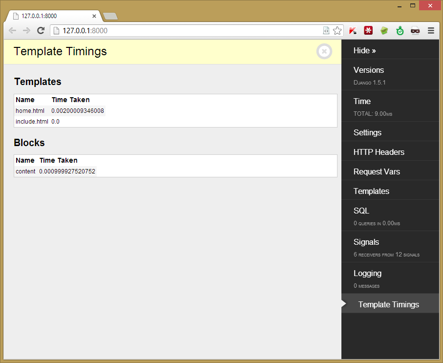

[My last post]() about the speed of Django's templating language caused a bit of a stir and it was clear that people didn't really have a clue how long the templates were taking to render in their applications.

##### Enter Template-timings
[Template-timings](https://github.com/orf/django-debug-toolbar-template-timings) is a panel for [Django-debug-toolbar](https://github.com/django-debug-toolbar/django-debug-toolbar) (which everyone should be using, right?) that lets you see a breakdown of the rendering process. It currently gives you timing information on each block and template rendered in a convenient panel. It works on ``, `` and ``'ed templates.

##### Download
[Check out the GitHub Repo](https://github.com/orf/django-debug-toolbar-template-timings) for installation instructions

##### How does this work?
Its quite simple. [This function](https://github.com/orf/django-debug-toolbar-template-timings/blob/master/template_timings_panel/panels/TemplateTimings.py#L14) replaces Template.render and BlockNode.render. It simply records how long the real render function takes.

Django's template rendering code is somewhat complex, and this is the best solution I could find. Its not perfect - there doesn't seem to be a way to tell what block belongs to what template for example, but it works.
